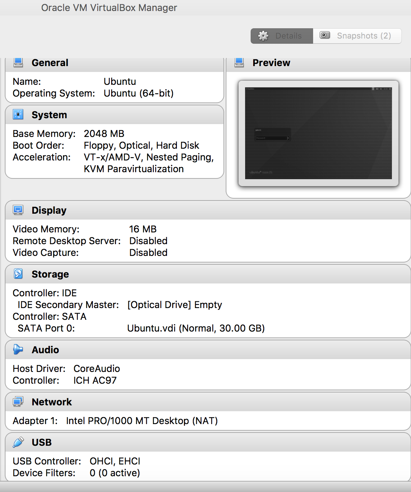
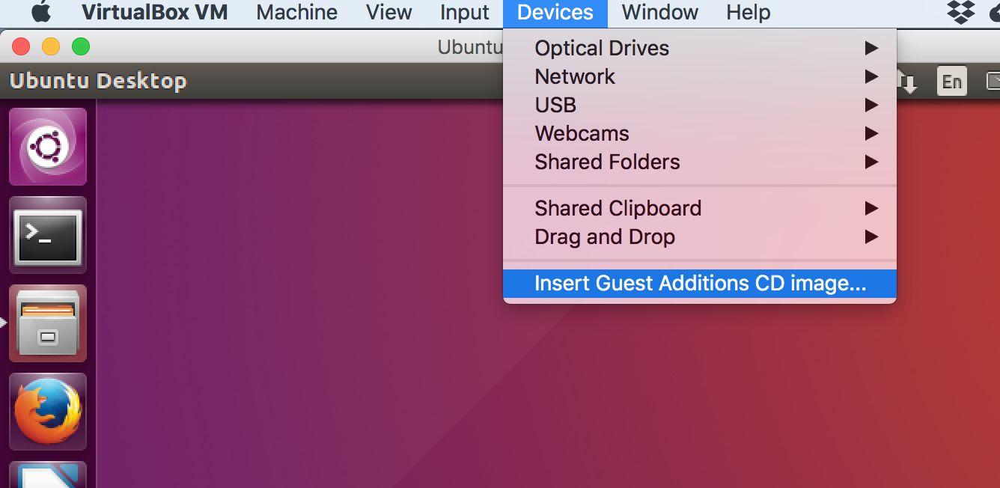
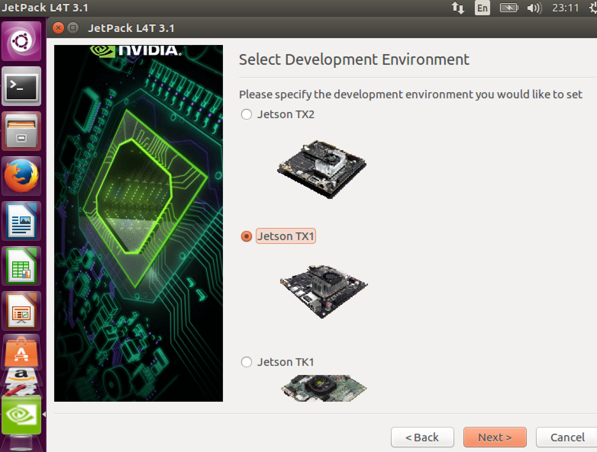
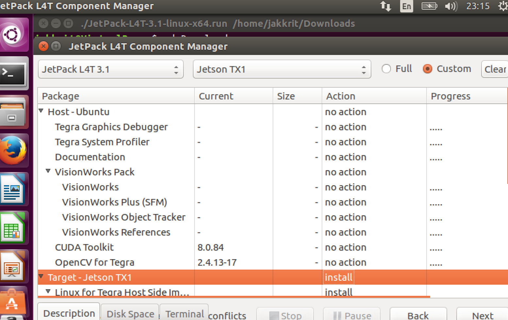

# Jetson RACECAR
This repo is my personal note of detailed instruction on building Jetson RACECAR which is based on [Jim's website](JetsonHack.com "JetsonHack").

# What you'll need
1.  __NVidia Jetson TX1 or TX2__ (This project uses the TX1) 

2. __Zed Camera__ 

3. __Amazon Basics USB Hub or else__ 

4. __Sparkfun 9 DOF Razor IMU__ 

5. __SSD Drive__ 

6. __Enertion FOCBOX VESC__ 

7. __Traxxas RC Car__ 

# Getting Started
## Wire up your Jetson
* Ethernet cable from Jetson to router (same network as host pc)
* USB from Jetson to host pc
* HDMI cable from Jetson to your monitor
* Mouse and keyboard (you may need usb hub)


## Step 1. Install Nvidia Jetpack on Host PC & Jetson TX1.
### In the end of this step you will be able to run CUDA examples on Jetson TX1.
 [See Video](https://photos.app.goo.gl/RfneNR6vpnrY4Q6m1)

1.1 Install virtual machine (ie. VirtualBox) running 64-bit Ubuntu 16.04 with at least 20 GB. You can skip this if you have Linux PC. 
Here is my setup 

1.2 Once logged in your newly installed Ubuntu, run 

```sudo apt-get update && sudo apt-get upgrade -y```

Tips: use fish shell for auto completion 

```sudo apt-get install fish -y```

Then you can activate fish shell instead of bash by typing ```fish```

*** If you use VirtualBox, don't forget to install Guest Additions in order to pass USB drive to the virtual machine.


1.3 Download Jetpack from [Nvidia](https://developer.nvidia.com/embedded/jetpack).
(As of writing I'm on Jetpack 3.1)

1.4 CD into downloaed directory and change file permission to run the script.

```chmod 755 JetPack-L4T-3.1-linux-x64.run```

1.5 Run the downloaded file.

``` ./JetPack-L4T-3.1-linux-x64.run```

* __select your applicable platform and select packages (choose 'no action' for the host and 'install' for the Jetson__)





1.5 Once installing completed, Post Installation window shows up. The script will flash os onto your Jetson.

_You will need to put Jetson in Force USB Recovery mode_
* 1.5.1 Power off the Jetson (completely pull the plug)
* 1.5.2 Plug power cord back then press power button.
* 1.5.3 Press and hold 'Rec' button.
* 1.5.4 While pressing 'Rec' hit 'RST' button, let go and wait a few seconds then release 'Rec' button.


*** if you use VirtualBox, Click 'Devices' and select 'Nvidia'. ***

* 1.5.5 To verify if your virtual machine sees the NVidia, open up new termimal and type ```lsusb```.

* 1.5.6 Back to last termimal and hit 'Enter' to begin flashing.


1.6 You should see Ubuntu loading up on your HDMI monitor connected to the Jetson.


1.7 At host pc (or virtual machine), the installation script will have a hard time looking for the Jetson's ip address. Select option 2 to manually enter the ip of the Jetson. 


1.8 You can grab the ip of the Jetson by heading over to Jetson and type 'ifconfig' or click the network icon on the top-right corner.


1.9 Enter the IP and username & password in the dialog box shown on the host pc.

Device IP Address: ```your ip```
Username: ```nvidia```
Password: ```nvidia```

*** just to confirm the process can access the device, you can try ssh into the Jetson using this info first ```ssh nvidia@192.168.1.99``` ***

if all goes well, hit enter.

1.10 Once finished, you can click _Remove downloaed files._


### __INSTALL CUDA 8.0 ON JETSON__

1.11 Now go to Jetson, and

```cd ~/cuda-l4t```

```cuda-l4t.sh cuda-repo-l4t-8-0-local_8.0.84-1_arm64.deb 8.0 8.0```

Then reload .bashrc since the script will add binaries to it.

```source ~/.bashrc```


now check if CUDA 8.0 is installed.

```nvcc -V```

To test it, run some sample files.

```cd ~/NVIDIA_CUDA-8.0_Samples/bin/aarch64/linux/release```

```./particles``` or anything else.
[See Video](https://photos.app.goo.gl/RfneNR6vpnrY4Q6m1)
