## Statistics Review
##### Notes from Youtube video created by [Brandon Foltz](https://www.youtube.com/channel/UCFrjdcImgcQVyFbK04MBEhA)
# 1. Population VS Sample Data
[video](https://www.youtube.com/watch?v=8X2xfwBP4uo&list=PLAshlHpA2Iwc10-3HIioqUtqG0Fc4MNpp&index=1&t=207s)

1. Not all the bulbs have the same longevity and power consumption -> they have some __*variation*__ (__standard deviation__) in both longevity and power consumption.
2. How do you test the whole *population* of bulbs wheter they conform to industry standard? You need *sample* of the *entire* population.

1. If you collect data on the WHOLE populatoin, it's called *census*.

1. Sample must be "__well-chosen__". But how?
2. Sample should be "__independent__" of each other.
3. Random sample is mostly used.

* You can't include 'men', 'women from other countries', 'older than 35 or younger than 18 female'.
* If half of you sample is NBA female, then they do not representn the whole population (NBA players are much taller than average).
* Like friend chooses friends to form a sample group (as they are like-minded).
* Say you call landline to collect interview data, but people mostly use mobile now. So people you got from landline interview does not necessarily represent the whole population.

A *sample* is an __approximation__ of the *population*.
* so always uncentainty attached to that approximation.

# Measure of Varibility:
## Variance & Standard Deviation
##### When you take sample out of the whole population, you will have errors or uncertainty => *variability*
We'll measure it -> variance & SD.

* Same *__mean__* doesn't tell anythin.
* Look at how data points show **spread** (or *distribution* or *variability*)
* Both classes have the same *mean* but Class1 has greater *variability* (or more spread out).
* Students in Class2 are more consistent to the scores (closer to the *mean*).

* Variance & SD help us answer -> how far datapoints are from the mean.
* Variance & SD are lower if spread less (see green stars vs blue stars above).
* Mean, Variance, SD should be used to compare against each other or against theoretical values.

* SD = sum of (diffences)

### Example - 2010 & 2011 NFL Goal Kick Data
The [excel](assets/nfl.xlsx) and [numbers (Mac)](assets/nfl.numbers) files are included.
* note that the [database obtained](http://www.nfl.com/stats/categorystats?seasonType=REG&d-447263-n=1&d-447263-o=2&d-447263-p=1&d-447263-s=KICKING_FG_LONG&tabSeq=0&season=2010&Submit=Go&experience=&archive=true&statisticCategory=FIELD_GOALS&conference=null&qualified=false) for this is different from the one shown in the original clips. Numbers (Number of datasets, Mean, Variance, and Standard Deviation) are a little bit different. 

Below are the screenshots of 2010 and 2011 field goals.
In this example we're interested in 'Line of Scrimmage' for the coach to analyze the distance for his or her kickers.

'Scrimmage' = 'Lng' - 17 yards.
 
'Placement' = 'Lng' - 7 Yards.

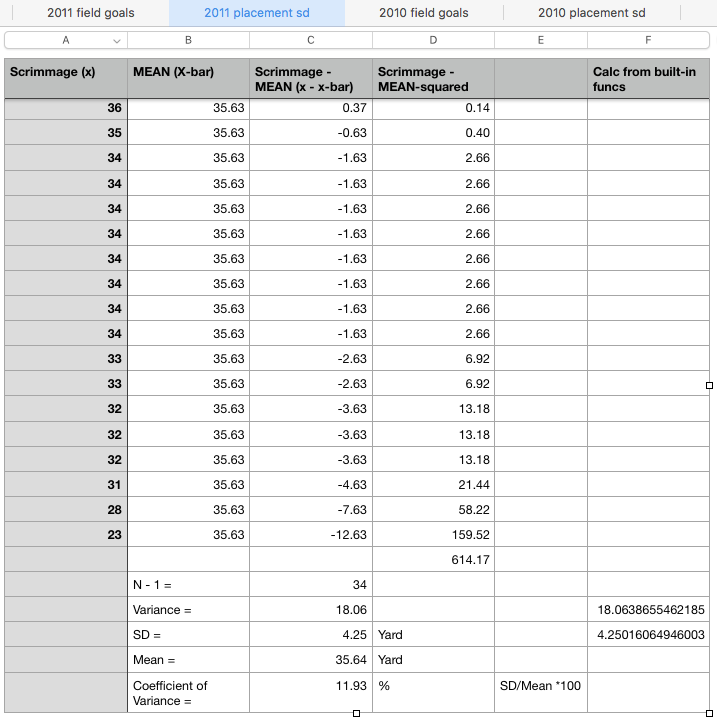

Notice the bell shape (histogram), the higher the SD, the more spread of the bell shape.

## Understand Z-Score
### Measures of Variability
Z-Score is a measurement of variability (how far is that datapoint from the mean) in multiplication of SD.

 
So, the mean itself has z-score of 0.
You would get a distance (z-score) by finding the distance from datapoint to the mean (x - x-bar) divided by SD.

# 2. Normal Distribution
### Is my data normal?
#### Before getting into stats calcs, we should visually see the data first.
##### Because some if not most calcs assume your data to be normally distributed.

These are visual tools to help you see data graphially.

For example, at the frequency of 5.0, Stem of 2 --> Each data point => Stem x Stem witdh 'Joined By' Leaf
 
0.021, 0.023, 0.023, 0.023, and 0.024

Box plots can also tell you if your data is normal if:
* it looks symmetrical.
* Quartile 1 & Quartile 3 are pretty much the same distance from the __median__ (datapoint in the middle).
* Top and bottom whiskers (vertical lines) are pretty much same length.

Note that 5 data points on above top whisker and 4 points below bottom whisker are data points that *__1.5 interquartile ranges__*.

#### Example - Is this data set normal?

So it does not fit normal distribution.
(Fits Lognormal)
 # 3. Bivariate Relationship
 ## 3.1 Covariance
 Looking at linear relationship between the 2 variables. *How they behave in PAIR.*
 These are loosely related:
 - Covariance
 - Linear Regression
 - Correlation

*__Covariance Example__*: Relationship between S&P VS. Dow Jones monthly return in 2012.
* At time '1' S&P return of 3.97% vs Dow Jones of 2.49%.
* If 'var A' moves this much, how would the 'var B' behave?
* It has 'LINEAR' pattern.
* If SP500 increases, DJI will also increase.
* This represent the reality that both of these indexes measure the same thing -- overall performance of stock market (but different ways).

#### Covariance is about DIRECTION only.
not strength.
 
'+' -> One goes up, the other goes up.
'-' -> One goes up, the other goes down.
'0' -> No pattern.

#### Formulas
Summation of (Each data point subtracts its mean) Times (Each data point subtracts its mean)
Divided by n - 1 or N __depending upon sample or population__

#### Example

* Take a sample of 10 data points collected each hours for number of workers (x) on the floor VS. number of product made (y) per that hour.
* We can calc that Covariance is POSITIVE 106.93 which means more workers more products, less workers less products.
* In Covariance, we only interested in 'POSITIVE' direction (sign) not the value of 106.93.

## 3.2 Covariance Matrix
Example: We have 4 variabes with number of sample of 20. Output from SPSS as follows:

* First thing we should do is VISUALLY INSPECT it wheter we might or might not have a linear relationship between what and what.
*__DUPLICATES__** means upper and lower diagonal are the same.

* Diagonals are **VARIANCE.**

* Covariance between the 2 variables are shown.

## 3.3 Correlation
- Same as Covariance but has 'Strength' indicator on top of 'Direction'.
- Correlation is between -1 and +1. So you can compare variables with different units.
- Correlation is standardized. Like z-score which measures how far that data point is from the mean (remember mean itself is 0).

*__What to look for__*

- VISUALLY LOOK AT SCATTER PLOT FIRST.
- Correlation is for LINEAR ONLY.
- Correlation might show up for some not-making sense stuff. Like full moon and number of dog barks.
- Watch out for correlation strength.

#### Example
SPSS output for DJI vs SP500 -> Correlation = 0.974
- DIAGONALS = Correlation

#### Example

# 4. Permutations VS. Combinations

 
## 4.1 Combinations
### Order doesn't matter

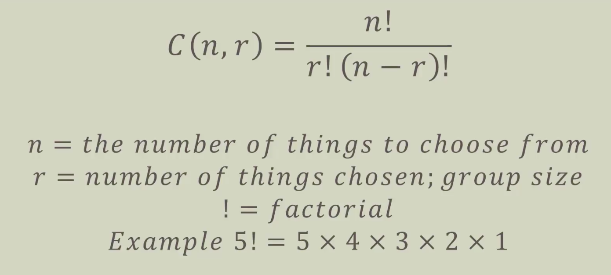

## 4.2 Permutations
### Order matters
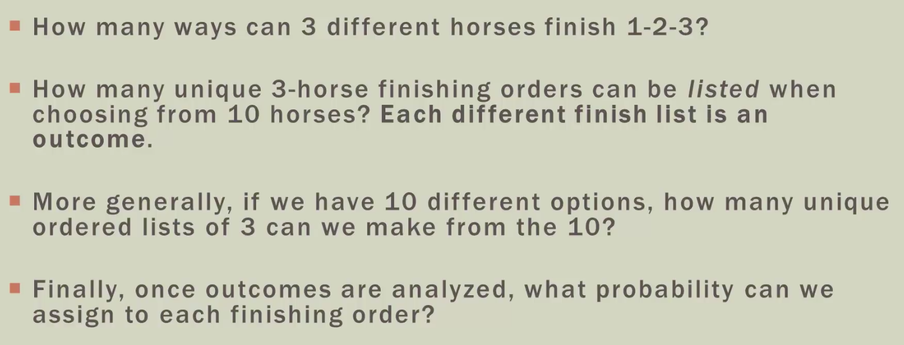

 

## 4.3 Examples of Combinations
### Losing Marbles

### Dogs of the Dow

### Nearly Normal

### Under The Curve

## 4.4 Finite Math: Set Operations and Notation

## 4.5 Venn Diagram Basics

## 4.6 Venn Diagram Region

## 4.7 Venn Diagram Practice

## 4.8 Joint & Marginal Probability

## 4.9 Playing With Full Deck (Combination Example)

# 5. Discrete Probability Distributions (PL05)
## 5.1 Random Variable Basics

## 5.2 Discrete Random Variable Basics

## 5.3 Discrete Random Variable Probability

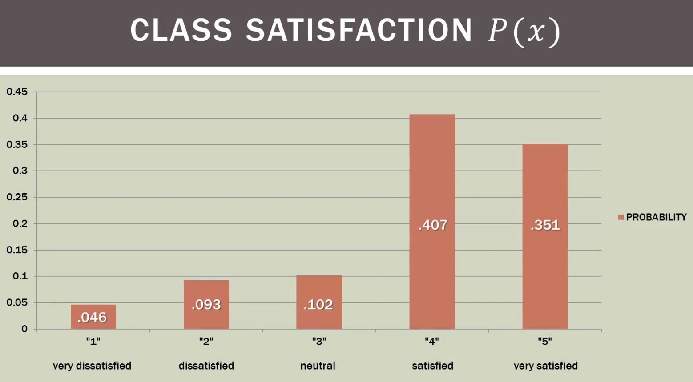

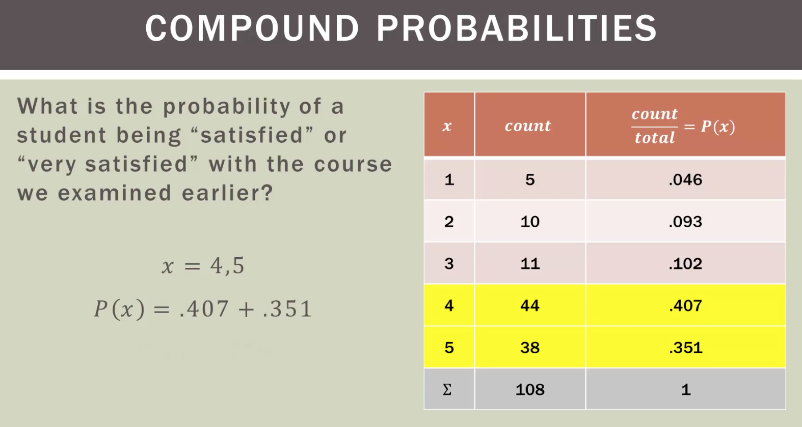

## 5.4 Expected Value

## 5.5 Discrete Random Variance

## 5.6 Binomial Distribution

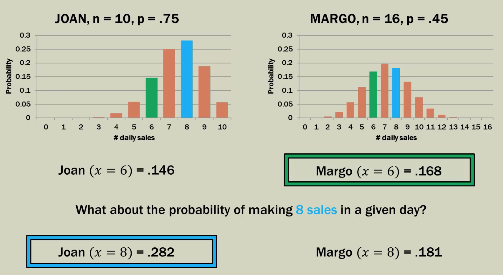

## 5.7 Binomial Mean & Standard Deviation

## 5.8 Binomial Example - Sales Problem

## 5.9 Binomial Example - Mac OSX Users

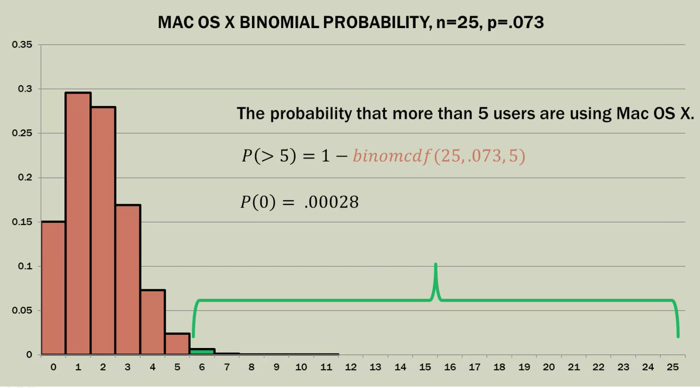

## 5.10 Binomial Example - Accident in Factory

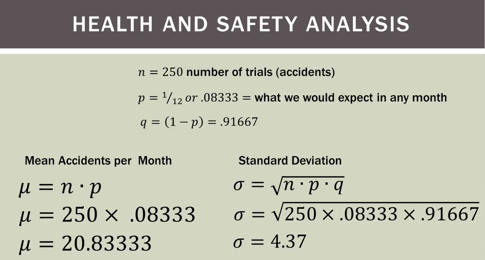

## 5.11 Poisson Distribution

## 5.12 Poisson Example - Bank & Deer

# 6. Uniform Probability Distribution

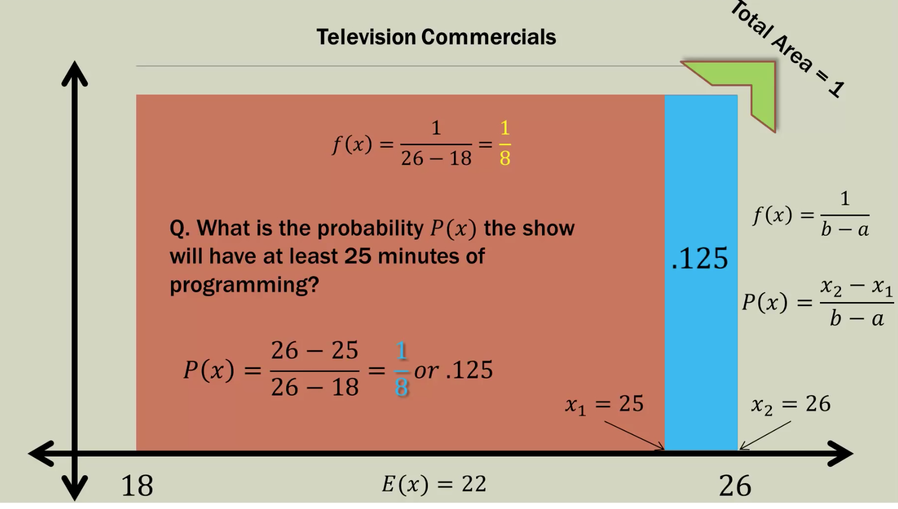

## 6.1 A Tour of Normal Distribution

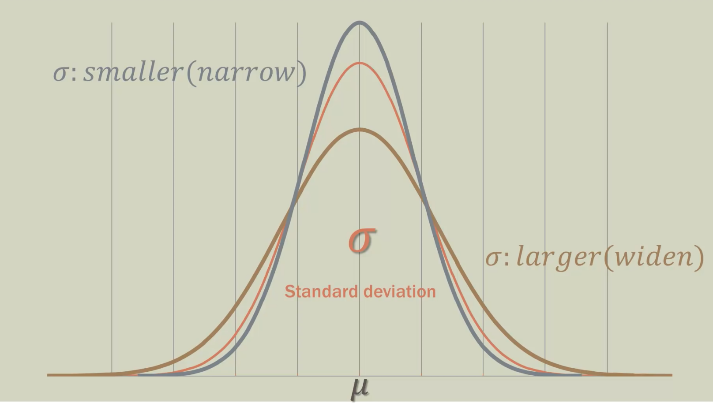

## 6.2 Z or T Distribution?

 ## 6.3 Normal Distribution Example
 
 
 
 
 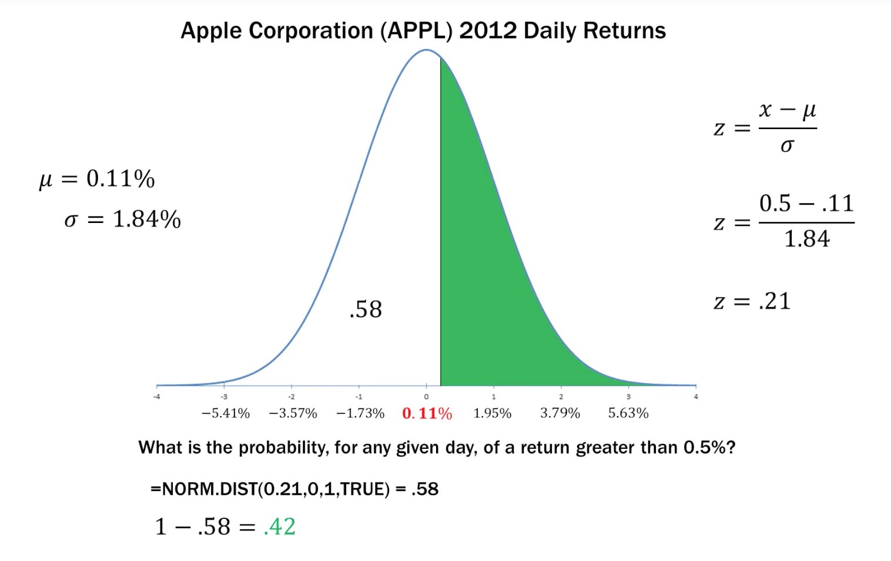
 
 
 
 
 
 
 
 
 
 